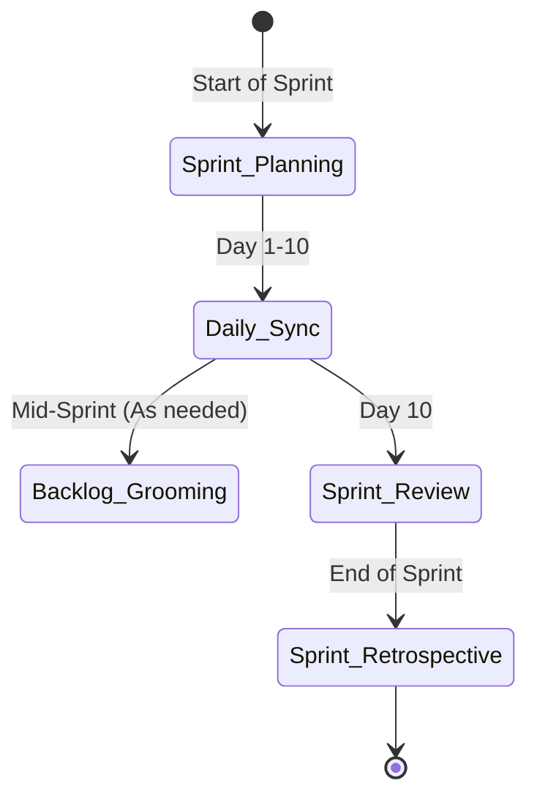
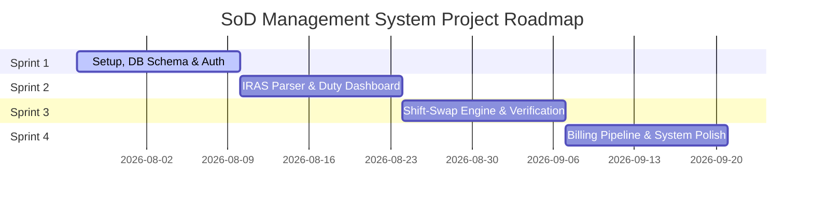

# Departmental SoD Management System - Agile Workflow & SDLC Project Plan

**Course:** CSE451 - Software Engineering  
**Semester:** Summer 2026  
**Project Title:** Departmental SoD (Student on Duty) Management System  
**Roles & Workflow Division:** 2-Member Team  
**Evaluation Mapped:** CO3 (SDLC Model Justification & Verification) & CO4 (Project Roles, Responsibilities, & Project Management)

---

## I. SDLC Lifecycle Model Selection: The Agile-V Hybrid Framework (CO3 Alignment)

To balance rapid, user-centric iterations with the strict validation required for departmental financial operations and class timetable conflict prevention, this project utilizes an **Agile-V Hybrid Process Model**. 

### 1. Process Model Justification & Argumentation
* **Why not Pure V-Model?** Pure V-Model is rigid and delays user feedback. Since the student workforce (SoD) and faculty members are active participants, we need to gather feedback incrementally on UI elements like the *Availability Grid* and the *Shift Swap dashboard*.
* **Why not Pure Agile (Scrum)?** Pure Agile can sometimes lead to technical debt and insufficient testing. Because this system manages student working hours and directly feeds into the monthly payment/billing pipeline, data integrity and conflict checks are safety-critical. We cannot afford bugs that cause students to miss classes or get paid incorrectly.
* **The Hybrid Solution:** We structure our project execution in **2-week Agile Sprints** to deliver functional increments, but we map each sprint's design artifacts directly to corresponding verification phases on the right side of the V-Model. This ensures that every functional requirement (FR) has a corresponding test suite before deployment.

```
       [User Requirements]  <======================================>  [User Acceptance Testing]
             (PRD / SRS)                                                     (End-User Pilot)
                  \                                                                /
          [System Design]  <====================================>  [System Integration Testing]
         (API / DB Schemas)                                               (E2E Flows: Shift Swaps)
                \                                                                /
          [Detailed Design]  <==================================>  [Unit & Module Testing]
        (Parser / Proxy Alg)                                             (Pytest / Jest Suites)
                  \                                                              /
                   ==================> [Implementation] =========================
                                   (Git Branching & Sprints)
```

### 2. Mapping SDLC Verification & Validation (V&V) Phases
Each lifecycle phase on the left side (Specification/Design) is verified by a phase on the right side (Testing) during our sprints:

| Left-Side (Design & Spec) | Right-Side (Verification & Validation) | Agile Implementation & Execution |
| :--- | :--- | :--- |
| **Requirements Analysis (SRS)** | **User Acceptance Testing (UAT)** | Validating user stories against the [Acceptance Criteria (docs/12-acceptance-criteria.md)](file:///Users/gm-ict/Documents/CSE451-SoftwareEngineering-SoDManagementSystem/docs/12-acceptance-criteria.md) with active students and faculty. |
| **System & Architectural Design** | **System & Integration Testing** | End-to-end testing of core pipelines: ensuring the Frontend UI triggers the Proxy Engine which successfully queries PostgreSQL and updates duty schedules. |
| **Detailed Design (Component)** | **Unit & Module Testing** | Writing unit tests using `pytest` for the IRAS Regex Parser and database constraint rules (preventing class duty overlaps). |

---

## II. Project Roles, Responsibilities, & RACI Matrix (CO4 Alignment)

Because the project is executed by a **2-member team**, the traditional software engineering roles must be consolidated while maintaining a clean separation of concerns and ensuring no gaps in project management.

### 1. Team Role Profiles & Responsibility Division

#### Team Member 1: Backend, Database, & DevOps Lead (Dev-1)
* **High-Level Role:** Backend Software Engineer, Database Administrator, and Release Manager.
* **Responsibilities:**
  1. **Database Architecture:** Designing the relational PostgreSQL schema, configuring constraints, and managing migrations using Alembic.
  2. **API & Logic Development:** Implementing the FastAPI asynchronous backend, role-based JWT authentication, and helper utility libraries.
  3. **Algorithm Design:** Building the **IRAS raw text parsing engine** (regex-based availability extractor) and the **Broadcast Proxy Engine** matching queries.
  4. **Infrastructure & CI/CD:** Writing the Docker Compose files, managing environment configurations, and writing GitHub Actions workflows for automated testing and linting.
  5. **Backend Verification:** Writing unit tests for the parser, database logic, and API endpoints using `pytest`.

#### Team Member 2: Frontend, UI/UX, & QA Specialist (Dev-2)
* **High-Level Role:** Frontend Software Engineer, UI/UX Designer, and Quality Assurance Lead.
* **Responsibilities:**
  1. **UI/UX Design:** Designing high-fidelity interactive wireframes, establishing the design system, and choosing the typography/colors.
  2. **Client-Side Development:** Building the Single Page Application (SPA) in React with TypeScript, using Vite as the bundler.
  3. **State Management & Integration:** Handling client-side state (JWT storage, duty lists) and integrating the React frontend with the FastAPI backend.
  4. **Feature Implementation:** Developing key interactive components: the **Availability Grid** editor, the **Shift Swapping dashboard**, and client-side schedule image exports (`html2canvas`).
  5. **Quality Assurance & Verification:** Writing frontend tests, conducting manual cross-browser checks, and executing User Acceptance Testing (UAT) based on user stories.

### 2. RACI Matrix (Responsible, Accountable, Consulted, Informed)
To ensure clear accountability, the following RACI matrix details responsibility across major project milestones:

| Lifecycle Activity / Milestone | Team Member 1 (Dev-1) | Team Member 2 (Dev-2) |
| :--- | :---: | :---: |
| **Requirements Specification (SRS & PRD updates)** | **A** / R | R |
| **Database Schema & Relational Design** | **A** / R | C |
| **UI/UX Mockups & Design Tokens** | I | **A** / R |
| **IRAS Parser Engine (Regex Logic)** | **A** / R | C |
| **Availability Grid Component (React)** | I | **A** / R |
| **Broadcast Proxy Engine Backend API** | **A** / R | I |
| **Shift Swap & Proxy UI Dashboard** | C | **A** / R |
| **Billing Pipeline & Financial Approvals API** | **A** / R | C |
| **Billing & Verification UI Panel** | C | **A** / R |
| **Schedule Export & PDF Utilities** | R | **A** / R |
| **CI/CD Integration & Docker Setup** | **A** / R | I |
| **System Integration & Acceptance Testing** | R | **A** / R |

* *R: Responsible (does the work); A: Accountable (final decision maker and owner); C: Consulted (provides input); I: Informed (kept up-to-date).*

---

## III. Agile Project Management & Ceremony Guidelines

To maintain progress, detect roadblocks early, and ensure continuous delivery, the team will follow an Agile Scrum-like framework tailored for a two-person team.

### 1. Agile Ceremonies (Custom 2-Person Adaptations)



* **Sprint Length:** 2-Week Sprints. Total Project Timeline: 4 Sprints (8 Weeks).
* **Sprint Planning (Bi-weekly, 1 hour):**
  * Both members review the Product Backlog.
  * Define the **Sprint Goal** based on the release strategy.
  * Pull User Stories into the Sprint Backlog, estimate story points using Fibonacci scale (1, 2, 3, 5, 8), and assign tasks.
* **Daily Sync (Daily, 10 mins):**
  * Conducted asynchronously via Slack/Teams or in-person at the beginning of the lab session.
  * Answer three questions: What did I accomplish yesterday? What will I work on today? Are there any blockers?
* **Backlog Grooming (Weekly, 30 mins):**
  * Refine user stories, write detailed acceptance criteria, and re-estimate based on team capacity and technical discoveries.
* **Sprint Review & Demo (Bi-weekly, 30 mins):**
  * Demonstrate a working increment of the web application. 
  * Collect user feedback (from lab manager, classmates, or project mentor).
* **Sprint Retrospective (Bi-weekly, 30 mins):**
  * Discuss what went well, what went wrong, and identify at least one concrete improvement for the next sprint.

### 2. Project Management KPIs
* **Velocity:** The total number of story points completed per sprint. Used to forecast capacity.
* **Sprint Burndown Chart:** Tracks remaining work hours/story points daily to ensure completion within the 2-week boundary.
* **Defect Density:** Number of bugs identified during integration and testing per sprint. Used to monitor QA effectiveness.

---

## IV. Git Branching, Pull Request, & Integration Workflow

A strict Git branching strategy enforces code quality and prevents integration issues. We adopt a modified **Git Flow / GitHub Flow** hybrid model.

```
main      ========================================= [Production Release]
             ^                               ^
release/     |                 [v1.0-RC] ====+ (Hotfix / Tag)
             |                 /             
dev       ========================================= [Integration Branch]
             \      ^         /      ^
feature/      [feat/auth] ===+        [feat/parser] ===
```

### 1. Branch Naming Conventions
All branch names must follow a standard prefix:
* `feature/` : New features or user stories (e.g., `feature/iras-regex-parser`, `feature/availability-grid-ui`).
* `bugfix/` : Resolving bugs identified during testing (e.g., `bugfix/jwt-expiration-error`).
* `hotfix/` : Immediate fixes required in production (e.g., `hotfix/db-connection-leak`).
* `release/` : Code freeze branches created before a major release (e.g., `release/v1.0`).

### 2. Pull Request (PR) & Integration Workflow
1. **Branch Creation:** Develop features locally on a dedicated branch branched off `dev`.
2. **Local Verification:**
   * Dev-1 runs backend unit tests (`pytest`).
   * Dev-2 runs frontend builds (`npm run build`) and type checks (`tsc`).
3. **Draft Pull Request:** Open a draft PR early on GitHub to indicate work-in-progress.
4. **Code Quality Gates (CI):**
   * Pushing code triggers a GitHub Actions workflow that automatically runs:
     - Linter: `flake8` / `black` (backend), `eslint` / `prettier` (frontend).
     - Static Analysis: TypeScript compilations.
     - Automated Tests: Unit test suites.
5. **Peer Review:** The other team member must perform a code review. No code can be merged to `dev` without:
   * At least one approving review.
   * All automated checks passing (green build).
   * Verified mapping to a specific GitHub Issue ID.
6. **Merge to Dev:** Merged using the "Squash and Merge" option to keep a clean commit history on the integration branch.
7. **Release Tagging:** At the end of a sprint, code from `dev` is merged to `main` with a semantic version tag (e.g., `v1.0.0`).

---

## V. Sprint-by-Sprint Execution & Milestone Schedule

This table outlines how the SDLC phases map to the 4 Sprints, defining deliverables and testing milestones for both team members.



| Sprint | Goal | Dev-1 (Backend / DB) Deliverables | Dev-2 (Frontend / QA) Deliverables | V-Model Verification Activity |
| :--- | :--- | :--- | :--- | :--- |
| **Sprint 1** | **Core Foundation & Auth** | FastAPI boilerplate setup; Docker Compose environment; PostgreSQL schemas; JWT auth routes. | React + Vite app boilerplate; CSS variable design system; Login/Register pages. | **Unit Testing:** Auth endpoints tested; SQL constraints validated. |
| **Sprint 2** | **IRAS Parser & Dashboard** | IRAS text processing engine; Task CRUD endpoints; Conflict checks backend logic. | Availability Grid page; Student Duty Dashboard; Task assignment form. | **Integration Testing:** Parser parses pasted text, updates availability grid. |
| **Sprint 3** | **Shift-Swapping Proxy** | Proxy Engine filtering algorithm; Swap transaction endpoint; Email/App notification dispatcher. | Swap request UI; Swap notifications; Schedule Image Export utility (`html2canvas`). | **System Testing:** E2E swap flows (Student A broadcasts -> Student B accepts -> DB updates). |
| **Sprint 4** | **Billing Pipeline & Polish** | Billing state-machine routes; CSV payroll logs export backend; Final performance optimizations. | Monthly bills table; Faculty verification dashboard; Manager final approval panel. | **Acceptance Testing:** Mock walkthrough of the full monthly cycle with end-users. |

---

## VI. GitHub Backlog: Epics, User Stories, & Task Breakdown

Below is the complete project backlog formatted as **GitHub Issues**. Each issue is designed to be imported directly into GitHub Projects, containing estimated Story Points (SP), priority levels, labels, assignees, and detailed descriptions.

```carousel
### Issue #1: User Registration & Role Assignment (US-001)
**Title:** `[Epic: E1] Implement User Registration and Role Setup`  
**Assignee:** Dev-1 (Backend) & Dev-2 (Frontend)  
**Story Points (SP):** 5  
**Priority:** High  
**Labels:** `feature`, `epic:auth`  

**Description:**  
Implement user registration using department ID. Assign default role as "Student" and provide manual admin override.

**Tasks:**
- [Backend] Create `users` table with fields: `id`, `department_id`, `name`, `email`, `hashed_password`, `role`. (Dev-1)
- [Backend] Write FastAPI registration endpoint `/api/v1/auth/register`. Validate department ID unique constraint. (Dev-1)
- [Frontend] Design and build `/register` UI form. Handle error responses (duplicate ID, weak password). (Dev-2)

**Acceptance Criteria (AC):**
- GIVEN a student provides their Department ID, unique email, and password.
- WHEN they submit the form.
- THEN the system registers the account and defaults the role to "Student".
<!-- slide -->
### Issue #2: Secure Login & Role-Based Access Control (US-002, US-003)
**Title:** `[Epic: E1] Secure Login API & Frontend RBAC Guard`  
**Assignee:** Dev-1 (Backend) & Dev-2 (Frontend)  
**Story Points (SP):** 5  
**Priority:** High  
**Labels:** `feature`, `security`  

**Description:**  
Implement secure login generating a short-lived JWT, and create frontend router guards preventing access to restricted pages (e.g., billing approval).

**Tasks:**
- [Backend] Configure Argon2id password hashing and `/api/v1/auth/login` token generation. (Dev-1)
- [Backend] Create dependencies to enforce roles (`Student`, `Faculty`, `Manager`) on API endpoints. (Dev-1)
- [Frontend] Build `/login` form, store JWT in local memory, and set up frontend route guards. (Dev-2)

**Acceptance Criteria (AC):**
- GIVEN a user logs in with incorrect credentials, a `401 Unauthorized` is returned.
- GIVEN a student attempts to navigate directly to `/admin/billing`, the system redirects to `/dashboard` with an access denied toast.
<!-- slide -->
### Issue #3: Regex-Based IRAS Schedule Parser (US-004)
**Title:** `[Epic: E2] Develop IRAS Raw Text Schedule Parser`  
**Assignee:** Dev-1 (Backend)  
**Story Points (SP):** 8  
**Priority:** High  
**Labels:** `feature`, `parser`  

**Description:**  
Develop the core backend parsing module that processes raw text blocks from the IRAS portal, extracts days, class hours, and course codes, and populates the database availability slots.

**Tasks:**
- [Backend] Design PostgreSQL schedule schema (`student_id`, `day_of_week`, `start_time`, `end_time`, `course_code`). (Dev-1)
- [Backend] Implement regex matching functions for IRAS raw text patterns. (Dev-1)
- [Backend] Build `/api/v1/schedule/parse` endpoint. Detect and handle invalid raw format. (Dev-1)

**Acceptance Criteria (AC):**
- GIVEN a student pastes valid IRAS timetable text.
- WHEN the parser executes.
- THEN the system correctly populates "Busy" blocks and returns a success response showing the count of slots parsed.
<!-- slide -->
### Issue #4: Availability Grid Interface (US-005, US-006)
**Title:** `[Epic: E2] Build Interactive Availability Grid UI`  
**Assignee:** Dev-2 (Frontend)  
**Story Points (SP):** 5  
**Priority:** High  
**Labels:** `feature`, `ui-component`  

**Description:**  
Build a weekly timetable grid component in React. Display parsed IRAS schedules as non-editable "Class" slots, and allow students to manually toggle additional "Busy" slots.

**Tasks:**
- [Frontend] Create visual grid component (Monday - Saturday, hourly blocks). (Dev-2)
- [Frontend] Connect component to `/api/v1/schedule/parse` and fetch endpoints to load availability. (Dev-2)
- [Frontend] Add double-click toggle behavior allowing users to manually override blocks. (Dev-2)

**Acceptance Criteria (AC):**
- GIVEN the student opens their availability page.
- WHEN the timetable loads.
- THEN parsed class hours are colored red (disabled) and manual overrides can be toggled by the user.
<!-- slide -->
### Issue #5: Duty Slot CRUD and Manager Dashboard (US-007)
**Title:** `[Epic: E3] Build Duty Slot Creation & Management`  
**Assignee:** Dev-1 (Backend) & Dev-2 (Frontend)  
**Story Points (SP):** 5  
**Priority:** High  
**Labels:** `feature`, `management`  

**Description:**  
Implement slot creation for Lab and Exam duties. Allow Managers to define duty windows, roles needed, and assign available students.

**Tasks:**
- [Backend] Implement `duties` schema and API routes for CRUD operations. (Dev-1)
- [Frontend] Build the manager's duty management dashboard to view all schedules. (Dev-2)
- [Frontend] Build the duty creation modal form. (Dev-2)

**Acceptance Criteria (AC):**
- GIVEN a Lab Manager creates a slot: "Lab Duty - Mon 9:00 AM".
- WHEN they assign Student A.
- THEN the system verifies availability and saves the assignment, notifying the student.
<!-- slide -->
### Issue #6: Scheduling Conflict Detection Engine (US-010)
**Title:** `[Epic: E3] Implement Real-time Scheduling Conflict Prevention`  
**Assignee:** Dev-1 (Backend)  
**Story Points (SP):** 5  
**Priority:** High  
**Labels:** `feature`, `safety-critical`  

**Description:**  
Develop the logic to check for overlaps between student schedules and assigned duty slots. Prevent managers from assigning a student if they have class.

**Tasks:**
- [Backend] Write database-level validation check during assignment. (Dev-1)
- [Backend] Return detail payload on error containing the specific course conflict (e.g., `PHY101`). (Dev-1)
- [Frontend] Show warning banners in the assignment UI when selecting conflicted students. (Dev-2)

**Acceptance Criteria (AC):**
- GIVEN a student has class on Monday 10:00 AM - 12:00 PM.
- WHEN a manager tries to assign them duty on Monday 11:00 AM.
- THEN the transaction is aborted, and a `409 Conflict` error is returned.
<!-- slide -->
### Issue #7: Shift Swap Proxy Engine Backend (US-011, US-012)
**Title:** `[Epic: E4] Broadcast Shift Swap & Candidate Matching`  
**Assignee:** Dev-1 (Backend)  
**Story Points (SP):** 8  
**Priority:** High  
**Labels:** `feature`, `proxy-engine`  

**Description:**  
Build the backend matching engine for shift swaps. When a student requests a swap, find all other students who are free and send them the broadcast.

**Tasks:**
- [Backend] Design `swaps` database schema containing: `original_duty_id`, `requesting_student_id`, `accepting_student_id`, `status`. (Dev-1)
- [Backend] Write query filtering for: `has_matching_role`, `is_free_at_target_time`, `is_not_already_assigned`. (Dev-1)
- [Backend] Create endpoint `/api/v1/swaps/available` to return eligible swaps for a logged-in student. (Dev-1)

**Acceptance Criteria (AC):**
- GIVEN Student A requests a swap for a duty on Tuesday 2:00 PM.
- WHEN the engine matches candidates.
- THEN only students who are free during that hour are shown the request in their backlog.
<!-- slide -->
### Issue #8: Shift Swap UI Portal (US-013)
**Title:** `[Epic: E4] Implement Shift Swap Portal and Acceptance Flow`  
**Assignee:** Dev-2 (Frontend)  
**Story Points (SP):** 5  
**Priority:** High  
**Labels:** `feature`, `ui-component`  

**Description:**  
Develop the user interface where students can request a shift swap and view/accept broadcasted swap requests from their peers.

**Tasks:**
- [Frontend] Add "Request Swap" button to the Student Duty Dashboard. (Dev-2)
- [Frontend] Build the Swap Feed page listing available trades. (Dev-2)
- [Frontend] Handle acceptance confirmation modal, updating local lists on success. (Dev-2)

**Acceptance Criteria (AC):**
- GIVEN Student B views their Swap Feed.
- WHEN they click "Accept" on Student A's request.
- THEN the duty ownership shifts to Student B, and both dashboards are immediately updated.
<!-- slide -->
### Issue #9: Billing State-Machine & Approval Pipeline (US-014, US-015, US-016)
**Title:** `[Epic: E5] Implement Multi-Stage Bill Approval Pipeline`  
**Assignee:** Dev-1 (Backend) & Dev-2 (Frontend)  
**Story Points (SP):** 8  
**Priority:** High  
**Labels:** `feature`, `billing`  

**Description:**  
Build the financial tracking pipeline. Students log completed duties, which are first verified by the assigned Faculty member, and then finally approved by the Department Manager.

**Tasks:**
- [Backend] Implement states: `Submitted`, `Faculty_Verified`, `Manager_Approved`, `Disputed`. (Dev-1)
- [Backend] Write API endpoint for faculty verification and manager final approval. (Dev-1)
- [Frontend] Build distinct dashboard panels for Faculty review and Manager financial release. (Dev-2)

**Acceptance Criteria (AC):**
- GIVEN a student submits their monthly bill.
- WHEN the Dept Manager views pending bills.
- THEN they only see bills that have already been verified by the relevant Faculty members.
<!-- slide -->
### Issue #10: Schedule Export and CSV Logging (US-018, US-019)
**Title:** `[Epic: E6] Export Visual Schedule Image & Monthly CSV`  
**Assignee:** Dev-2 (Frontend) & Dev-1 (Backend)  
**Story Points (SP):** 5  
**Priority:** Medium  
**Labels:** `feature`, `utility`  

**Description:**  
Develop client-side visual schedule PNG image generation and backend manager CSV log exports for payroll processing.

**Tasks:**
- [Frontend] Integrate `html2canvas` to render the availability grid and duties as a downloadable PNG image. (Dev-2)
- [Backend] Write `/api/v1/export/report/csv` stream returning monthly aggregated duty hours for payroll. (Dev-1)

**Acceptance Criteria (AC):**
- GIVEN a student clicks "Export Schedule".
- THEN a PNG file of the exact weekly grid is downloaded.
- GIVEN a manager requests a CSV report, a file formatted with student IDs, verified hours, and total payouts is generated.
```

---

## VII. Verification and Testing Framework (V-Model Integration)

To satisfy the right-hand verification stages of our SDLC model:

### 1. Automated Testing (Unit & Integration)
* **Backend:** `pytest` is used for test-driven development (TDD).
  * Executed before every pull request merge.
  * *Example Command:* `pytest backend/tests/`
* **Frontend:** `Vitest` and `React Testing Library` verify core component rendering.
  * *Example Command:* `npm run test`

### 2. Manual Verification & QA (Acceptance Testing)
For each release cycle (Milestone):
1. **Developer Sandbox:** Devs verify code builds correctly locally using `docker-compose up --build`.
2. **Review Environment:** Feature branches are checked by the peer developer.
3. **UAT Walkthrough:** End-to-end scenarios (such as parsing a complex timetable with multiple conflicts) are walk-through tested, confirming clear user error handling.
