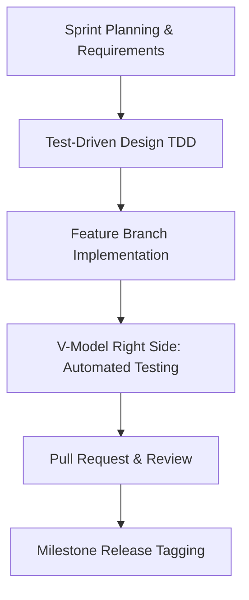

# Software Development Life Cycle (SDLC) & Implementation Summary

This document provides a comprehensive overview of the Software Development Life Cycle (SDLC) process, engineering methodologies, and work accomplished for the departmental **Student-on-Duty (SoD) Management System**.

---

## 1. SDLC Process & Methodologies

The project followed a hybrid **Agile** and **V-Model Validation** framework to ensure structured planning, rapid feature delivery, and strict quality verification.

### A. Agile Iterations
* **Sprint Planning:** Divided deliverables into 4 distinct sprints with granular tasks, clear boundaries, and specific user stories.
- **Git Branching Strategy:** Implemented a strict branch workflow:
  * `main` holds production-ready, tagged code.
  * `dev` serves as the integration branch.
  * Features developed on dedicated topic branches (e.g., `feature/availability-grid-ui`, `feature/swap-management`).
* **Pull Requests & Code Reviews:** All features merged into `dev` via squash-merges. Releases merged into `main` via PRs containing release notes, followed by semver tagging (e.g., `v2.0.0`).
* **Conventional Commits:** Standardized logs linking back to GitHub issues (e.g., `feat(tasks): implement duty slot CRUD and conflict prevention logic #5 #6`).

### B. V-Model Verification & Quality Gates
* **Test-Driven Development (TDD):** Designed database models and API router responses to assert specific error schema layouts matching the Technical Design Documents (TDD).
* **Automated Regression Testing:** Wrote async integration tests for each backend endpoint, sharing a local SQLite memory session.
* **Type-Safe Frontends:** Enforced strict TypeScript type verification on Vite build hooks to eliminate runtime errors.

---

## 2. Sprint Deliverables Summary

Across the 4 sprints, the team delivered a fully integrated, multi-role web portal enabling students to manage availability, trade shifts, and log work hours, while supervisors audit scheduling constraints and release payroll claims.

### Sprint 1: Multi-Role Authentication (v1.0.0)
* **Backend:**
  * Created `User` database tables storing department IDs, emails, hashed passwords, and roles (`Student`, `Faculty`, `LabManager`, `DeptManager`).
  * Built JWT token authentication, login, and registration routers.
* **Frontend:**
  * Developed login and registration form views.
  * Built JWT token local storage handling and a protective React router guard redirecting users based on active session scopes.

### Sprint 2: IRAS Parser & Duty Dashboard (v2.0.0)
* **Backend:**
  * Created `Schedule` and `Duty` database tables.
  * Developed a regular expression parsing engine extracting courses, day names, and time slots from raw copy-pasted IRAS academic text blocks.
  * Built `/schedule/me` and `/schedule/override` endpoints allowing students to toggle manual overrides.
  * Built `/tasks` CRUD routers executing database-level overlap validation querying active student class times and overrides. Returns a structured `409 Conflict` on scheduling clashes.
* **Frontend:**
  * Created the **Weekly timetable grid** (Monday-Saturday, hourly slots) rendering parsed academic schedules (non-editable class slots) and manual overrides.
  * Built visual Create/Assign duty modals displaying real-time warning banners with exact class/busy overlaps on backend conflict reports.

### Sprint 3: Swap Board & Notifications (v3.0.0)
* **Backend:**
  * Created `Swap` and `Notification` database tables.
  * Developed `/swaps/request` supporting public broadcasts and private swaps. If public, the backend queries and matches only eligible (non-conflicted) students to receive broadcast notifications.
  * Developed `/swaps/{id}/respond?approve={bool}` which automatically transfers duty ownership in the database upon acceptance.
* **Frontend:**
  * Created the `useNotifications` hook fetching inbox alerts with **10-second polling** to simulate real-time notification push events.
  * Restricted trade request selection dropdowns to only include the student's own assigned duties.
  * Added a notification bell layout to the top header bar displaying active unread badge counts.

### Sprint 4: Billing Approvals & Exports (v4.0.0)
* **Backend:**
  * Created `billing_claims` tables calculating student hours logged against standard rates (e.g., 150 BDT/USD per hour).
  * Built submit endpoints with double-submission guards blocking duplicate claims for the same month.
  * Implemented state transition rules: `Pending` $\rightarrow$ `Verified` (by Faculty) $\rightarrow$ `Approved` (by Managers) $\rightarrow$ `Paid` (by Department Heads).
  * Developed `/billing/export` compiling approved payout data into streaming CSV reports.
* **Frontend:**
  * Synced hooks to manage claim submission forms and multi-step approvals.
  * Added an **Export Payroll CSV** button on the supervisor's admin billing dashboard.

---

## 3. SDLC Quality Metrics & Accomplishments

At the close of development, the system successfully passed all verification gates:

| Quality Dimension | Metric / Target | Status |
| :--- | :--- | :--- |
| **Backend Unit Tests** | 15 Integration Tests | **15/15 Passed (100%)** |
| **Frontend Compiler** | Vite + TSC Build | **Success (0 Errors)** |
| **GitHub Issues** | 12/12 Sprint Issues | **CLOSED (100%)** |
| **Release Tags** | 4 SemVer Tags Pushed | **v1.0.0, v2.0.0, v3.0.0, v4.0.0** |

All deliverables are fully complete, verified, and merged into the production `main` branch.
