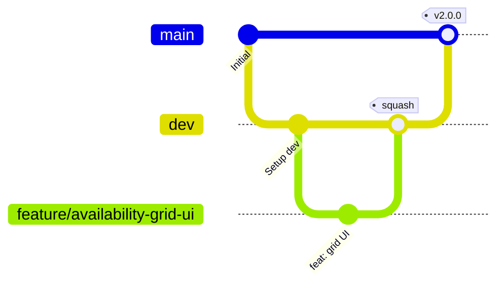

# Unified Team Operational & Git Workflow

This document defines the unified development workflow, Git branching strategy, commit guidelines, pull request protocols, and release pipelines for the Departmental **Student-on-Duty (SoD) Management System**. All team members must adhere to this workflow to maintain a clean git history and project boards.

---

## 1. Issue Management & Project Boards

The project uses a Kanban-style board to track tasks. Every piece of work must start with a GitHub Issue.

* **Issue Creation:** Every issue must contain a descriptive title, user story (GIVEN/WHEN/THEN), acceptance criteria, and specific task checklist.
* **Kanban Board Transitions:**
  * **To Do:** Unassigned or planned tasks for the current sprint.
  * **In Progress:** Move card here when starting work on a branch.
  * **Done:** Cards transition here automatically when their linked issues are closed via Pull Request merge keywords.

---

## 2. Git Branching Strategy

The repository structure relies on two permanent branches and temporary topic branches.



### Permanent Branches
* **`main`:** Production-ready code only. No commits should be made directly to `main`.
* **`dev`:** The integration branch where features are compiled and tested together.

### Topic Branches
* **Feature Branches:** For user stories. Named as `feature/<sprint-topic>` (e.g. `feature/swap-management`). Created off the latest `dev` branch.
* **Bugfix Branches:** For post-sprint fixes. Named as `bugfix/<issue-topic>`. Created off `dev`.
* **Hotfix Branches:** For critical production issues. Named as `hotfix/<fix-topic>`. Created off `main` and merged to both `main` and `dev`.

---

## 3. Commit Guidelines

Commits must follow the **Conventional Commits** standard and link to active issues.

```
<type>(<scope>): <description> #<issue_number>
```

* **Types:**
  * `feat`: A new feature (e.g., `feat(swaps): add swap request API #7`).
  * `fix`: A bug fix.
  * `docs`: Documentation updates.
  * `test`: Adding or modifying tests.
  * `refactor`: Code restructuring without behavior changes.
* **Format Guidelines:**
  * Keep the subject line under 72 characters.
  * Write the message in the present, imperative tense (e.g., "add endpoint" instead of "added endpoint").
  * Always append the issue identifier at the end (e.g., `#5`).

---

## 4. Pull Requests & Merging Protocol

Integrating code from a feature branch back to production is a two-step process.

### Step 1: Feature Integration (Topic Branch $\rightarrow$ `dev`)
1. Prior to submitting the PR, execute the **Quality Gates** locally.
2. Push your topic branch to origin and open a Pull Request targeting `dev`.
3. In the PR body, include a brief description of changes and use the automatic closing keywords:
   `Closes #<issue_number>` or `Fixes #<issue_number>`.
4. Perform a **Squash and Merge** to keep the `dev` git history clean and linear. Delete the topic branch on GitHub upon successful merge.

### Step 2: Milestone Release (dev $\rightarrow$ `main`)
1. Once all sprint deliverables are integrated and verified on `dev`, open a release PR from `dev` to `main`.
2. Title it using: `release(<sprint>): <Sprint Topic> release vX.Y.Z`.
3. Perform a standard **Merge Commit** (do not squash) to preserve the historical release milestones.
4. Switch to your local `main` branch, pull, and tag the release:
   ```bash
   git checkout main
   git pull origin main
   git tag -a vX.Y.Z -m "Release vX.Y.Z - Sprint description"
   git push origin vX.Y.Z
   ```

---

## 5. Automated Quality Gates

No code should be merged into `dev` or `main` unless it satisfies these two checks:

1. **Backend Integration Tests:**
   Run the full FastAPI pytest suite inside the virtual environment:
   ```bash
   PYTHONPATH=backend backend/.venv/bin/pytest backend/tests/
   ```
   *Assert:* $100\%$ test cases must pass successfully.

2. **Frontend Type Verification & Compilation:**
   Execute compilation checks inside the React Vite project:
   ```bash
   npm run build --prefix frontend
   ```
   *Assert:* Vite must compile the production bundle with $0$ errors.
