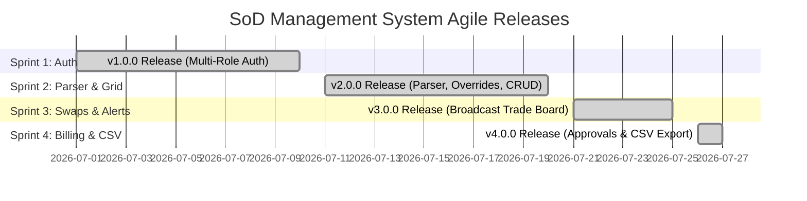
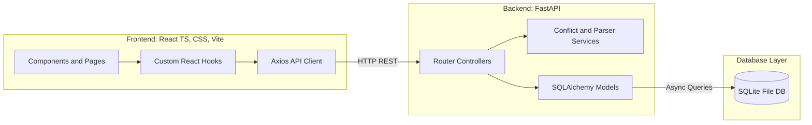
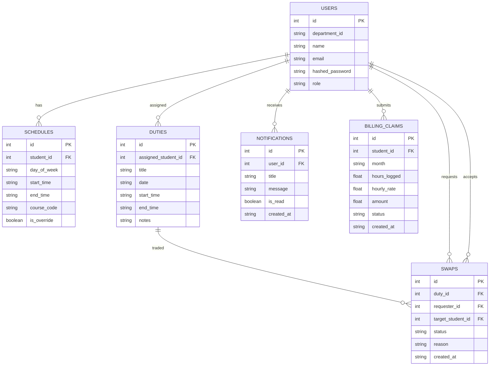
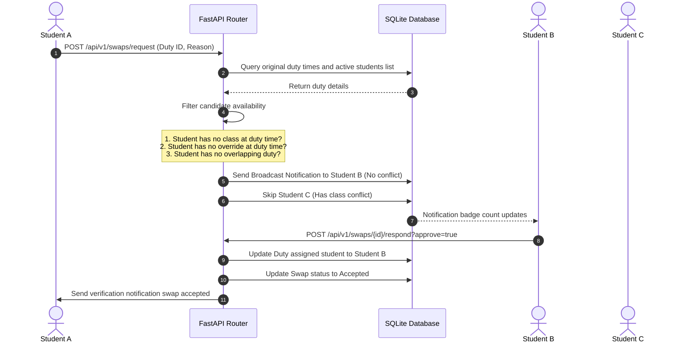

# Agile Project Retrospective & System Architecture

This document provides a comprehensive Agile retrospective, architectural blueprint, and database entity relationship model for the Departmental **Student-on-Duty (SoD) Management System**.

---

## 1. Agile Release Roadmap

The project was executed across 4 structured sprints, culminating in the production-ready **v4.0.0** final release.

* **Sprint 1 (v1.0.0):** Established core token security and role routing boundaries.
* **Sprint 2 (v2.0.0):** Delivered the IRAS schedule regex parser, weekly interactive grid, and manager duty planner with real-time collision warnings.
* **Sprint 3 (v3.0.0):** Enabled peers to request public broadcasts or targeted trades, backed by candidate availability filters.
* **Sprint 4 (v4.0.0):** Finalized the multi-step verification pipeline and payroll report downloads.

---

## 2. System Architecture

The application is built using a decoupled **Client-Server MVC Pattern**.

### Key Components
1. **FastAPI Controllers:** Routers handle payload validation, parse parameters, enforce JWT role security, and call database actions inside async sessions.
2. **Business Logic Services:**
   * **IRAS Parser:** Extracted timetables via regex normalizing strings.
   * **Collision Checker:** Queries overlap boundaries:
     $$\text{Start}_{24} < \text{End}_{\text{existing}} \quad \text{AND} \quad \text{End}_{24} > \text{Start}_{\text{existing}}$$
3. **Custom React Hooks:** Isolates HTTP requests from representation views, managing states locally and polling endpoints for push notifications.

---

## 3. Database Entity Relationship (ER) Model

The database schemas are built using SQLAlchemy, linking records to track student duty cycles.

---

## 4. Shift Swap Broadcast Matching Engine Flow

The broadcast matching engine automatically filters out conflicted student peers to deliver clean notifications.

