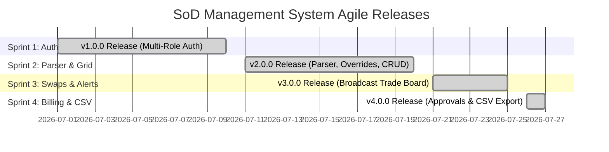
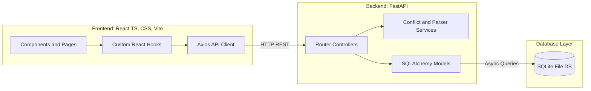
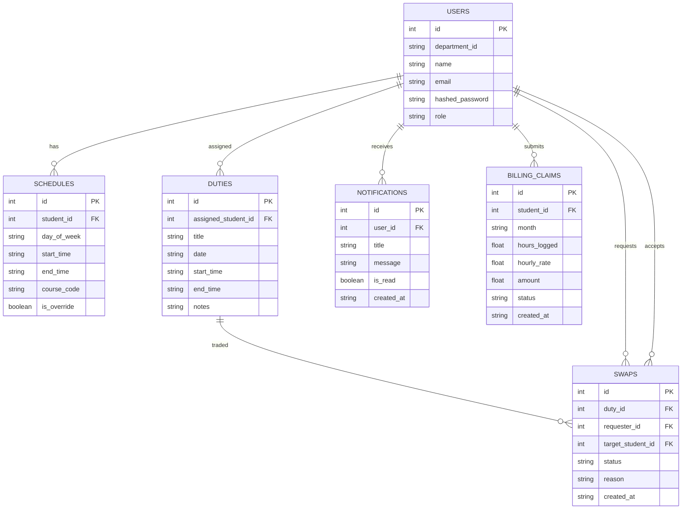
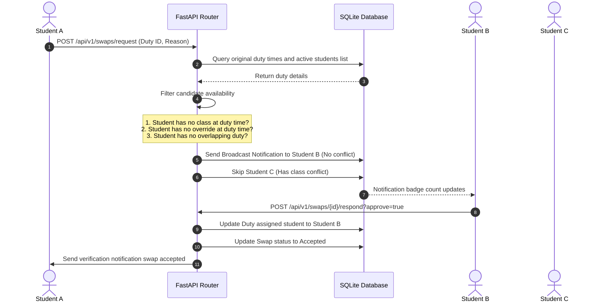

# Agile Project Retrospective & System Architecture

This document provides a comprehensive Agile retrospective, architectural blueprint, database entity relationship model, API directory, and SDLC verification mapping for the Departmental **Student-on-Duty (SoD) Management System**.

---

## 1. Agile Release Roadmap

The project was executed across 4 structured sprints, culminating in the production-ready **v4.0.0** final release.

### Agile Sprint Breakdown
* **Sprint 1 (v1.0.0):** Multi-Role JWT authentication. Closed Issues #1 and #2.
* **Sprint 2 (v2.0.0):** Regex IRAS Parser, interactive timetable availability grid, manual overrides, and Manager Duty CRUD with real-time class overlap collision warnings. Closed Issues #3, #4, #5, and #6.
* **Sprint 3 (v3.0.0):** Shift Swap trade backlog, public/private broadcasts filtering, and inbox notification hubs. Closed Issues #7, #8, and #9.
* **Sprint 4 (v4.0.0):** Multi-stage billing approvals (Student submit $\rightarrow$ Faculty verify $\rightarrow$ Manager approve $\rightarrow$ Payout release) and streaming CSV payroll exports. Closed Issues #10, #11, and #12.

---

## 2. System Architecture

The application is built using a decoupled **Client-Server MVC Pattern**.

### Core Architectural Layers
1. **Presentation Layer (Vite + React TS + Vanilla CSS):**
   * Role-tailored dashboards to render clean UI scopes.
   * State management encapsulated inside custom React hooks (e.g. `useSchedule.ts`, `useSwaps.ts`), shielding components from REST endpoints.
2. **Business Logic Layer (FastAPI Services):**
   * **IRAS Parser:** Utilizes clean regex blocks to normalize copy-pasted schedule data into structured database slots.
   * **Conflict Checker:** Ensures student scheduling safety by comparing target times against class slots and override boundaries:
     $$\text{Start}_{24} < \text{End}_{\text{existing}} \quad \text{AND} \quad \text{End}_{24} > \text{Start}_{\text{existing}}$$
3. **Data Layer (SQLAlchemy ORM + SQLite):**
   * Async database operations utilizing `SQLAlchemy` sessions to handle transactional safety.

---

## 3. Database Entity Relationship (ER) Model

The database schemas are built using SQLAlchemy, linking records to track student duty cycles.

---

## 4. Shift Swap Broadcast Matching Engine Flow

The broadcast matching engine automatically filters out conflicted student peers to deliver clean notifications.

---

## 5. System API Directory

The SoD Management System APIs are grouped into 5 modular scopes, exposing clean RESTful handlers.

| Module | HTTP Method | Endpoint Path | Description | Access Scope |
| :--- | :---: | :--- | :--- | :---: |
| **Auth** | `POST` | `/api/v1/auth/register` | Registers new user profile | Public |
| | `POST` | `/api/v1/auth/login` | Validates credentials and issues JWT | Public |
| | `GET` | `/api/v1/auth/students` | Lists all registered student accounts | Registered Users |
| **Schedule** | `POST` | `/api/v1/schedule/parse` | Regex parsing of copy-pasted IRAS text | Student |
| | `GET` | `/api/v1/schedule/me` | Fetches active user weekly timetable slots | Student |
| | `POST` | `/api/v1/schedule/override` | Toggles busy manual override state | Student |
| | `GET` | `/api/v1/schedule/student/{id}` | Fetches target student schedule slots | Supervisor / Manager |
| **Duties** | `POST` | `/api/v1/tasks` | Creates duty shift slot (validates conflicts) | Manager |
| | `GET` | `/api/v1/tasks` | Lists duty slots (filtered by user context) | All Roles |
| | `PATCH` | `/api/v1/tasks/{id}` | Assigns student or edits notes / completion | All Roles (Scoped) |
| | `DELETE` | `/api/v1/tasks/{id}` | Deletes duty slot | Manager |
| **Swaps** | `POST` | `/api/v1/swaps/request` | Requests shift trade (public/private) | Student |
| | `GET` | `/api/v1/swaps` | Lists pending and accepted swap requests | All Roles (Scoped) |
| | `POST` | `/api/v1/swaps/{id}/respond` | Accepts or declines a trade offer | Student |
| **Billing** | `POST` | `/api/v1/billing/submit` | Submits monthly hourly claim sheet | Student |
| | `GET` | `/api/v1/billing/claims` | Lists claims (filtered by status / student) | All Roles (Scoped) |
| | `POST` | `/api/v1/billing/{id}/approve` | Multi-stage approvals (verify/approve/pay) | Faculty / Manager |
| | `GET` | `/api/v1/billing/export` | Downloads payroll report in CSV format | Faculty / Manager |

---

## 6. SDLC Verification (V-Model Mapping)

Every functional requirement and user story is tied to automated integration testing files under `backend/tests/` to guarantee coverage and prevent regressions.

| User Story | Requirements Scope | Verification Target | Test File Path |
| :--- | :--- | :--- | :--- |
| **US-001 / US-002** | User Registration & JWT Login | Successful register, duplicate checks, login token issuance | [test_auth.py](file:///Users/gm-ict/Documents/CSE451-SoftwareEngineering-SoDManagementSystem/backend/tests/test_auth.py) |
| **US-004** | IRAS Schedule Parser | UTF-8 parsing, extraction of day names and hours | [test_schedule.py](file:///Users/gm-ict/Documents/CSE451-SoftwareEngineering-SoDManagementSystem/backend/tests/test_schedule.py) |
| **US-005 / US-006** | Availability Grid & Overrides | manual toggle of overrides, database saving | [test_schedule.py](file:///Users/gm-ict/Documents/CSE451-SoftwareEngineering-SoDManagementSystem/backend/tests/test_schedule.py) |
| **US-007 / US-010** | Duty Slots CRUD & Conflicts | Prevent overlapping assignment, CRUD controls, check scopes | [test_duty.py](file:///Users/gm-ict/Documents/CSE451-SoftwareEngineering-SoDManagementSystem/backend/tests/test_duty.py) |
| **US-008 / US-011** | Swap Request, Broadcast & Inbox | Overlap-free candidate notifications routing, trade response reassignments | [test_swap.py](file:///Users/gm-ict/Documents/CSE451-SoftwareEngineering-SoDManagementSystem/backend/tests/test_swap.py) |
| **US-012 / US-013** | Billing Pipeline & CSV Export | Double-submission guard, state validations, CSV streaming headers | [test_billing.py](file:///Users/gm-ict/Documents/CSE451-SoftwareEngineering-SoDManagementSystem/backend/tests/test_billing.py) |

---

## 7. Retrospective & Future Roadmap Backlog

### Lessons Learned
1. **SQLite Type Mappings:** Storing time fields as ISO-formatted string boundaries (`HH:MM`) allowed async comparison operators (`<ctrl94>`, `<`) to execute fast in both SQLite and Postgres.
2. **Decoupled Business Hooks:** Consolidating state managers into isolated hooks (like `useSchedule.ts`) facilitated easy API migrations from mock states to FastAPI endpoints.

### Future Roadmap Backlog
* **Live WebSockets:** Replace 10-second polling loops with active WebSocket connections to push instant notifications.
* **Faculty Email Triggers:** Implement SMTP email alerts when a billing claim is submitted for verification.
* **Mobile Adaptability:** Port visual schedule grids to responsive native mobile app grids.
