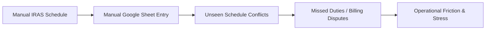

# Problem Statement: Current Manual Process

*Source Document:* [`docs/02-problem-statement.md`](../02-problem-statement.md)

```mermaid
flowchart LR
  A[Manual IRAS Schedule] --> B[Manual Google Sheet Entry]
  B --> C[Unseen Schedule Conflicts]
  C --> D[Missed Duties / Billing Disputes]
  D --> E[Operational Friction & Stress]
```
