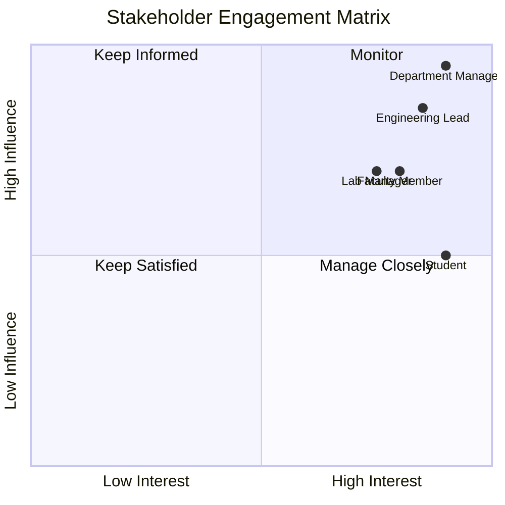

# Stakeholder Analysis & Power-Interest Matrix

*Source Document:* [`docs/03-stakeholder-analysis.md`](../03-stakeholder-analysis.md)

```mermaid
quadrantChart
    title Stakeholder Engagement Matrix
    x-axis Low Interest --> High Interest
    y-axis Low Influence --> High Influence
    quadrant-1 Monitor
    quadrant-2 Keep Informed
    quadrant-3 Keep Satisfied
    quadrant-4 Manage Closely
    "Department Manager": [0.90, 0.95]
    "Engineering Lead": [0.85, 0.85]
    "Faculty Member": [0.80, 0.70]
    "Lab Manager": [0.75, 0.70]
    "Student": [0.90, 0.50]
```
