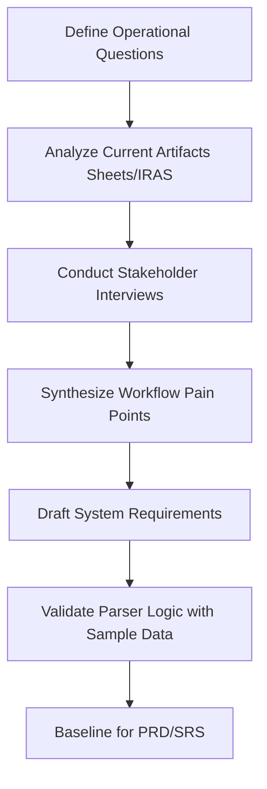

# Information Gathering Requirements Workflow

*Source Document:* [`docs/04-information-gathering.md`](../04-information-gathering.md)

```mermaid
flowchart TD
  A[Define Operational Questions] --> B[Analyze Current Artifacts Sheets/IRAS]
  B --> C[Conduct Stakeholder Interviews]
  C --> D[Synthesize Workflow Pain Points]
  D --> E[Draft System Requirements]
  E --> F[Validate Parser Logic with Sample Data]
  F --> G[Baseline for PRD/SRS]
```
