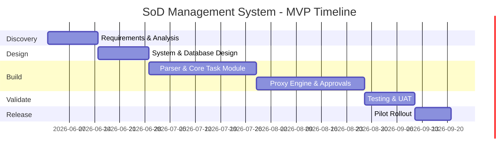

# Technical & Operational Feasibility Decision Tree

*Source Document:* [`docs/07-feasibility-analysis.md`](../07-feasibility-analysis.md)

```mermaid
gantt
    title SoD Management System - MVP Timeline
    dateFormat  YYYY-MM-DD
    section Discovery
    Requirements & Analysis      :a1, 2026-06-01, 14d
    section Design
    System & Database Design    :a2, after a1, 14d
    section Build
    Parser & Core Task Module    :a3, after a2, 30d
    Proxy Engine & Approvals    :a4, after a3, 30d
    section Validate
    Testing & UAT               :a5, after a4, 14d
    section Release
    Pilot Rollout               :a6, after a5, 10d
```
