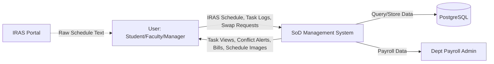

# Data Flow Diagram: Context Level 0

*Source Document:* [`docs/16-dfd.md`](../16-dfd.md)

```mermaid
flowchart LR
  U[User: Student/Faculty/Manager] -->|IRAS Schedule, Task Logs, Swap Requests| S[SoD Management System]
  S -->|Task Views, Conflict Alerts, Bills, Schedule Images| U
  S -->|Query/Store Data| DB[(PostgreSQL)]
  IRAS[IRAS Portal] -.->|Raw Schedule Text| U
  S -->|Payroll Data| PM[Dept Payroll Admin]
```
