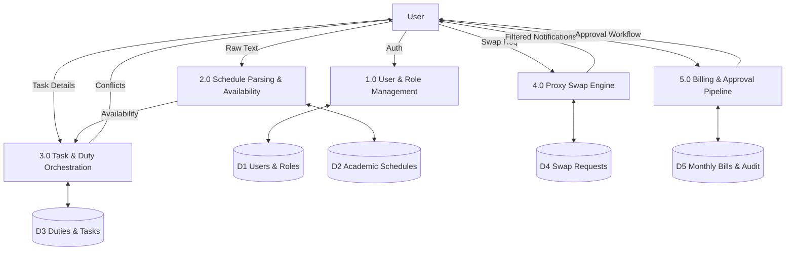

# Data Flow Diagram: Level 1 System Decomposition

*Source Document:* [`docs/16-dfd.md`](../16-dfd.md)

```mermaid
flowchart TD
  U[User]
  P1[1.0 User & Role Management]
  P2[2.0 Schedule Parsing & Availability]
  P3[3.0 Task & Duty Orchestration]
  P4[4.0 Proxy Swap Engine]
  P5[5.0 Billing & Approval Pipeline]
  
  D1[(D1 Users & Roles)]
  D2[(D2 Academic Schedules)]
  D3[(D3 Duties & Tasks)]
  D4[(D4 Swap Requests)]
  D5[(D5 Monthly Bills & Audit)]

  U -->|Auth| P1
  U -->|Raw Text| P2
  U -->|Task Details| P3
  U -->|Swap Req| P4
  U -->|Bill Submission| P5

  P1 <--> D1
  P2 <--> D2
  P3 <--> D3
  P4 <--> D4
  P5 <--> D5

  P2 -->|Availability| P3
  P3 -->|Conflicts| U
  P4 -->|Filtered Notifications| U
  P5 -->|Approval Workflow| U
```
