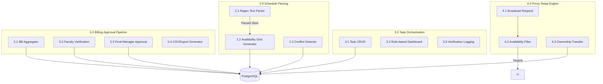

# Data Flow Diagram: Level 2 Shift Swap Subsystem

*Source Document:* [`docs/16-dfd.md`](../16-dfd.md)

```mermaid
flowchart TD
  subgraph SP[2.0 Schedule Parsing]
    P21[2.1 Regex Text Parser]
    P22[2.2 Availability Grid Generator]
    P23[2.3 Conflict Detector]
  end

  subgraph TO[3.0 Task Orchestration]
    P31[3.1 Task CRUD]
    P32[3.2 Role-based Dashboard]
    P33[3.3 Verification Logging]
  end

  subgraph PSE[4.0 Proxy Swap Engine]
    P41[4.1 Broadcast Request]
    P42[4.2 Availability Filter]
    P43[4.3 Ownership Transfer]
  end

  subgraph BAP[5.0 Billing Approval Pipeline]
    P51[5.1 Bill Aggregator]
    P52[5.2 Faculty Verification]
    P53[5.3 Final Manager Approval]
    P54[5.4 CSV/Export Generator]
  end

  DB[(PostgreSQL)]

  P21 -->|Parsed Slots| P22
  P22 --> DB
  P23 --> DB
  P31 --> DB
  P41 --> P42
  P42 -->|Targets| U
  P43 --> DB
  P51 --> DB
  P52 --> DB
  P53 --> DB
```
