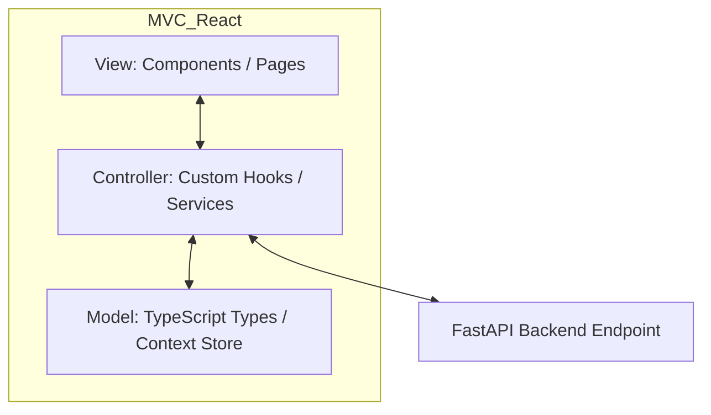

# Developer Workplans Module Dependency Graph

*Source Document:* [`docs/25-developer-workplans.md`](../25-developer-workplans.md)

```mermaid
flowchart TD
  subgraph MVC_React
    V[View: Components / Pages] <--> C[Controller: Custom Hooks / Services]
    C <--> M[Model: TypeScript Types / Context Store]
  end
  C <--> API[FastAPI Backend Endpoint]
```
