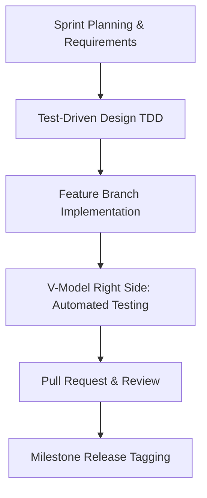

# SDLC V-Model Verification & Validation Matrix

*Source Document:* [`docs/27-sdlc-and-implementation-summary.md`](../27-sdlc-and-implementation-summary.md)

```mermaid
graph TD
    A[Sprint Planning & Requirements] --> B[Test-Driven Design TDD]
    B --> C[Feature Branch Implementation]
    C --> D[V-Model Right Side: Automated Testing]
    D --> E[Pull Request & Review]
    E --> F[Milestone Release Tagging]
```
