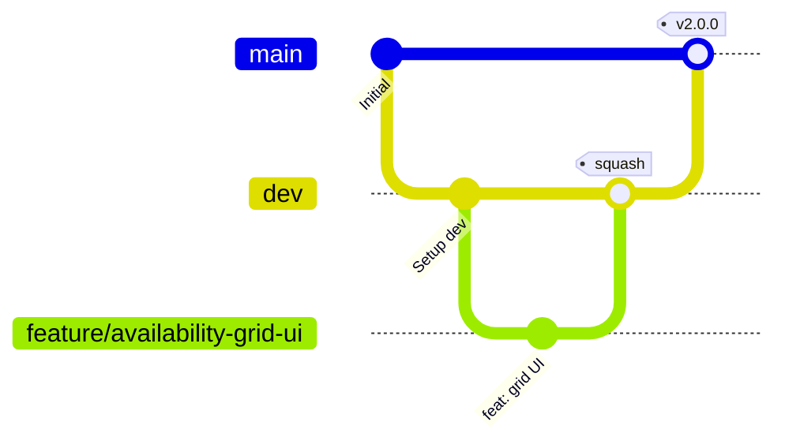

# Unified Team Workflow & Communication Loop

*Source Document:* [`docs/28-unified-team-workflow.md`](../28-unified-team-workflow.md)

```mermaid
gitGraph
    commit id: "Initial"
    branch dev
    checkout dev
    commit id: "Setup dev"
    branch feature/availability-grid-ui
    checkout feature/availability-grid-ui
    commit id: "feat: grid UI"
    checkout dev
    merge feature/availability-grid-ui tag: "squash"
    checkout main
    merge dev tag: "v2.0.0"
```
