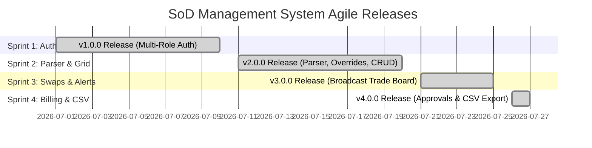

# Agile Development Release Roadmap (Sprints 1-4)

*Source Document:* [`docs/29-agile-project-plan-and-architecture.md`](../29-agile-project-plan-and-architecture.md)

```mermaid
gantt
    title SoD Management System Agile Releases
    dateFormat  YYYY-MM-DD
    section Sprint 1: Auth
    v1.0.0 Release (Multi-Role Auth)      :done, 2026-07-01, 2026-07-10
    section Sprint 2: Parser & Grid
    v2.0.0 Release (Parser, Overrides, CRUD) :done, 2026-07-11, 2026-07-20
    section Sprint 3: Swaps & Alerts
    v3.0.0 Release (Broadcast Trade Board)   :done, 2026-07-21, 2026-07-25
    section Sprint 4: Billing & CSV
    v4.0.0 Release (Approvals & CSV Export)  :done, 2026-07-26, 2026-07-27
```
