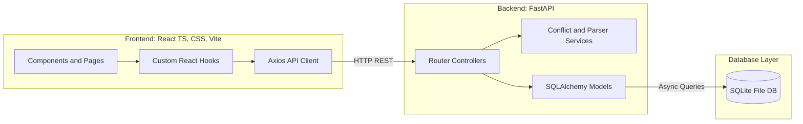

# Decoupled Client-Server MVC System Architecture

*Source Document:* [`docs/29-agile-project-plan-and-architecture.md`](../29-agile-project-plan-and-architecture.md)

```mermaid
graph LR
    subgraph Frontend ["Frontend: React TS, CSS, Vite"]
        A[Components and Pages] --> B[Custom React Hooks]
        B --> C[Axios API Client]
    end

    subgraph Backend ["Backend: FastAPI"]
        C -->|HTTP REST| D[Router Controllers]
        D --> E[Conflict and Parser Services]
        D --> F[SQLAlchemy Models]
    end

    subgraph Database ["Database Layer"]
        F -->|Async Queries| G[(SQLite File DB)]
    end
```
