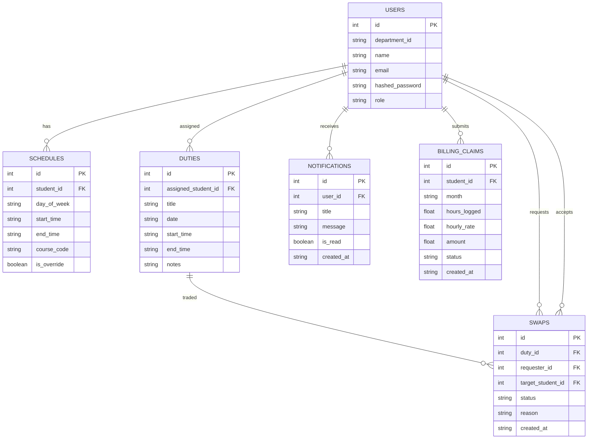

# Database Entity Relationship (ER) Model

*Source Document:* [`docs/29-agile-project-plan-and-architecture.md`](../29-agile-project-plan-and-architecture.md)

```mermaid
erDiagram
    USERS {
        int id PK
        string department_id
        string name
        string email
        string hashed_password
        string role
    }
    SCHEDULES {
        int id PK
        int student_id FK
        string day_of_week
        string start_time
        string end_time
        string course_code
        boolean is_override
    }
    DUTIES {
        int id PK
        int assigned_student_id FK
        string title
        string date
        string start_time
        string end_time
        string notes
    }
    SWAPS {
        int id PK
        int duty_id FK
        int requester_id FK
        int target_student_id FK
        string status
        string reason
        string created_at
    }
    NOTIFICATIONS {
        int id PK
        int user_id FK
        string title
        string message
        boolean is_read
        string created_at
    }
    BILLING_CLAIMS {
        int id PK
        int student_id FK
        string month
        float hours_logged
        float hourly_rate
        float amount
        string status
        string created_at
    }

    USERS ||--o{ SCHEDULES : has
    USERS ||--o{ DUTIES : assigned
    DUTIES ||--o{ SWAPS : traded
    USERS ||--o{ SWAPS : requests
    USERS ||--o{ SWAPS : accepts
    USERS ||--o{ NOTIFICATIONS : receives
    USERS ||--o{ BILLING_CLAIMS : submits
```
