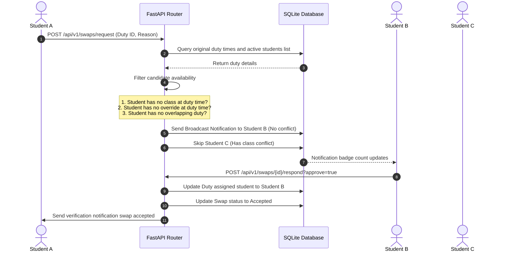

# Shift Swap Broadcast Matching Engine Sequence Flow

*Source Document:* [`docs/29-agile-project-plan-and-architecture.md`](../29-agile-project-plan-and-architecture.md)

```mermaid
sequenceDiagram
    autonumber
    actor A as Student A
    participant API as FastAPI Router
    participant DB as SQLite Database
    actor B as Student B
    actor C as Student C

    A->>API: POST /api/v1/swaps/request (Duty ID, Reason)
    API->>DB: Query original duty times and active students list
    DB-->>API: Return duty details
    API->>API: Filter candidate availability
    Note over API: 1. Student has no class at duty time?<br/>2. Student has no override at duty time?<br/>3. Student has no overlapping duty?
    API->>DB: Send Broadcast Notification to Student B (No conflict)
    API->>DB: Skip Student C (Has class conflict)
    DB-->>B: Notification badge count updates
    B->>API: POST /api/v1/swaps/{id}/respond?approve=true
    API->>DB: Update Duty assigned student to Student B
    API->>DB: Update Swap status to Accepted
    API->>A: Send verification notification swap accepted
```
